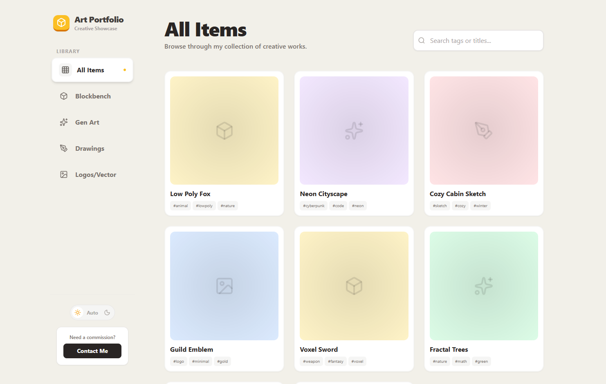

# Art Portfolio/Showcase Prototype

A modern, responsive React prototype application designed to showcase a creative portfolio, featuring a clean UI with filtering, searching, and a detailed modal view for art items.



## Features

- **Categorized Gallery**: Filter items by categories (3D models, Gen Art, Drawings, Logos/Vector).
- **Search Functionality**: Real-time search by title or tags.
- **Responsive Design**: Fully responsive layout that works on desktop and mobile.
- **Dark/Light Mode**: System-aware theme switching with manual override.
- **Interactive Modal**: Detailed view for each art piece with zoom capability.
- **Modern UI**: Built with Tailwind CSS for a sleek, consistent look.

## Tech Stack

- **React** (v19)
- **TypeScript**
- **Tailwind CSS**
- **Lucide React** (Icons)

## Getting Started

### Prerequisites

- Node.js installed
- npm or yarn

### Installation

1. Navigate to the project directory:

   ```bash
   cd art_showcase_portfolio
   ```

2. Install dependencies:

   ```bash
   npm install
   ```

### Running the App

Runs the app in the development mode.

```bash
npm start
```

Open [http://localhost:3000](http://localhost:3000) to view it in the browser.

### Building for Production

Builds the app for production to the `build` folder.

```bash
npm run build
```

## License

This project is licensed under MIT License.
